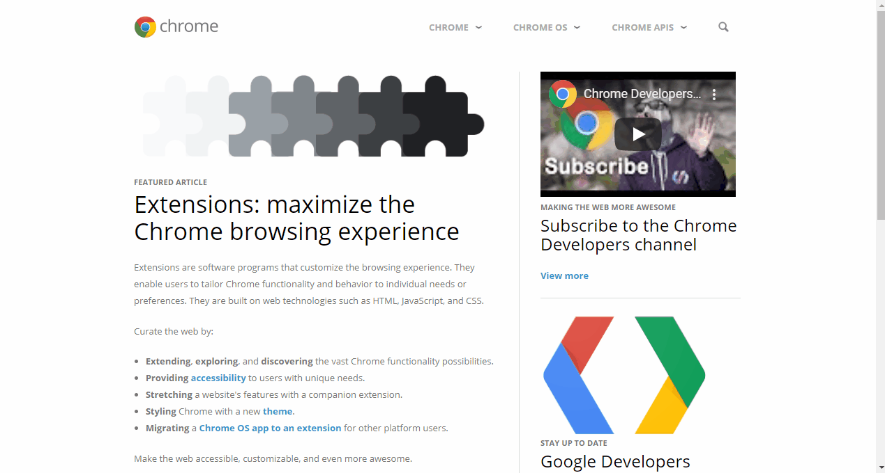
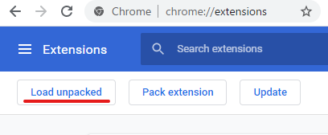

#  Chrome dev tool - CSS Context 


[Chrome web store](https://chrome.google.com/webstore/detail/css-context/mnjgkjmfcoelaigcjmmmhbgfonkpgion)

This extension display the following informations on the Element's **CSS Context** pane:
- css property **display, position, float, clear** and **z-index**
- containing block of current element
- stacking context of current element
- if or not current element creates new stacking context



## Setup
```sh
npm install
```

## Start
Start application.
```sh
npm start
```
Open Google Chrome and display **chrome://extensions/**. Then, click **Load unpacked** button and load **dist** directory.



So, you can use this extension.

## Test
Start applicaton and serve tests directory's html files.
```sh
npm test
```
So, open browser and display test directory.
If you install this extension(dist directory), you can test this extension's behavior.

## Production build
```sh
npm run all
```
So, **dist.zip** will be created for deploy.